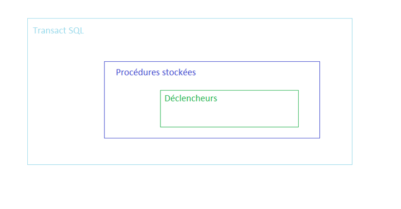

= Notions de Transact SQL
Timothée Robert
:doctype: article
:encoding: utf-8
:lang: fr
:toc: left
:toclevels: 3
:icons: font
:source-highlighter: rouge
:rouge-style: github

// -- PARTIE 1 : COURS --

== Introduction

[OBJECTIFS]
====
L'étude des déclencheurs (triggers) est mise en avant dans le référentiel du BTS SIO SLAM comme une solution de *défense en profondeur* côté serveur.
Le prérequis pour aborder les déclencheurs est la maîtrise des procédures stockées, qui elle-même repose sur la connaissance de Transact SQL (T-SQL).
====

=== Qu'est-ce que le Transact SQL ?

Transact SQL est une **extension du langage SQL** propriétaire à Microsoft SQL Server. Sa connaissance est indispensable pour aborder les notions de l'épreuve E6 sur la Cybersécurité, notamment les déclencheurs.

Le T-SQL permet notamment de :

* Exécuter des instructions SQL en mode interactif ou par lots (batch).
* Programmer des procédures stockées.
* Programmer des déclencheurs (triggers).

== Instructions de base T-SQL

=== Organisation du code

`GO`::
Force l'exécution des instructions précédentes en un seul lot.

`USE database_name`::
Permet de sélectionner la base de données sur laquelle travailler. C'est un réflexe à avoir pour ne pas impacter les bases des autres.

`-- Commentaire sur une ligne`::
Les deux tirets permettent un commentaire monoligne.

`/* Commentaire sur plusieurs lignes */`::
Permet d'écrire des blocs de commentaires.

`BEGIN...END`::
Délimite un bloc d'instructions, par exemple dans une condition ou une boucle.

=== Affichage

La commande `PRINT` affiche une chaîne de caractères ou le contenu d'une variable dans la console de messages.

[source,sql]
----
-- Concaténation simple avec l'opérateur +
PRINT 'Le message à afficher.';
PRINT 'Il y a ' + @ma_variable + ' éléments.';
----

=== Les variables

==== Déclaration : `DECLARE`

Toute variable en T-SQL doit être déclarée avec `DECLARE` et son nom doit commencer par un arobase (`@`).

[source,sql]
----
DECLARE @nom_variable type_de_donnees;
DECLARE @compteur INT;
DECLARE @nom_eleve VARCHAR(50);
----

==== Affectation : `SET` et `SELECT`

`SET` et `SELECT` permettent toutes deux d'affecter une valeur à une variable.

* **SET** est utilisé pour affecter *une seule variable* à la fois. C'est l'outil standard pour initialiser un compteur ou une valeur simple.
[source,sql]
----
DECLARE @compteur INT;
SET @compteur = 1;
SET @compteur = @compteur + 1;
----

* **SELECT** peut affecter *plusieurs variables en même temps* et peut surtout récupérer sa valeur directement depuis une requête sur une table.
[source,sql]
----
DECLARE @nom_jeu VARCHAR(100), @prix_jeu DECIMAL(5,2);

-- Récupère le nom et le prix d'un jeu et les stocke dans des variables
SELECT @nom_jeu = nom, @prix_jeu = prix
FROM SOFTWARE.JEUX
WHERE id_jeu = 42;
----

NOTE: Si une requête `SELECT` utilisée pour une affectation retourne plusieurs lignes, seule la **dernière ligne** est utilisée pour l'affectation des variables. La variable système `@@ROWCOUNT` contient le nombre de lignes affectées par la dernière instruction.

=== Structures de contrôle

==== Conditions : `IF...ELSE`

La structure est simple et ne nécessite pas de parenthèses pour la condition ni d'accolades pour les blocs. On utilise `BEGIN` et `END` pour les blocs de plus d'une instruction.

[source,sql]
----
IF @compteur > 10
BEGIN
    PRINT 'Le compteur a dépassé 10.';
    -- Autre instruction...
END
ELSE
BEGIN
    PRINT 'Le compteur est inférieur ou égal à 10.';
END;
----

==== Boucles : `WHILE`

T-SQL n'a pas de boucle `FOR`. La boucle principale est `WHILE`.

[source,sql]
----
DECLARE @i INT = 1;
WHILE @i <= 10
BEGIN
    PRINT 'Ligne numéro ' + CAST(@i AS VARCHAR);
    SET @i = @i + 1;
END;
----

Les instructions `BREAK` (pour sortir de la boucle) et `CONTINUE` (pour passer à l'itération suivante) fonctionnent comme dans d'autres langages. L'instruction `GOTO` existe mais son usage est fortement déconseillé.

=== Types personnalisés : `CREATE TYPE`

T-SQL permet de créer ses propres types de données à partir de types existants pour renforcer la cohérence du modèle.

[source,sql]
----
-- Crée un type "email" basé sur un VARCHAR(255) qui ne peut pas être nul.
CREATE TYPE type_email FROM VARCHAR(255) NOT NULL;
GO

-- Utilisation du type personnalisé dans une déclaration de variable
DECLARE @email_utilisateur type_email = 'test@example.com';
----

// -- PARTIE 2 : TRAVAUX PRATIQUES --

== Travaux Pratiques : Instructions de base T-SQL

=== Exo 1 : Instruction SELECT (Rappels)

Chargez et exécutez le script `005 - Script creation table FormationEleves.sql`.

.Contenu du script de création de la table FormationEleves
[source,sql]
----
include::scripts/005-Script création table FormationEleves.sql[]
----
. Que font les instructions `DROP TABLE` et `DROP SCHEMA` (lignes 2 et 3) ?
. Dans quelle vue système de métadonnées sont stockées les informations sur les schémas ?
. Expliquez le reste du programme et ce qu'il affiche.

TIP: La question 2 vous invite à utiliser l'explorateur d'objets de SSMS pour fouiller dans les vues systèmes (`sys.`).

=== Exo 2 : Variables et agrégats 📈

Le but est de manipuler des variables issues de calculs sur un ensemble de données, pas juste un simple comptage.

1.  Créez un programme qui calcule le **nombre d'heures de cours d'info moyen** des élves de la table `PROCS.FORMATIONELEVES` et stockez-le dans une variable nommée `@nb_heures_moyen`.
2.  Déclarez deux autres variables : `@nom_ecole_max_heures` (VARCHAR) et `@nb_heures_info_max` (DECIMAL).
3.  En une seule requête `SELECT`, récupérez le **nom** de l'école avec le plus d'heures de cours d'info et le nombre d'heures d'info maximum.
4.  Affichez un message récapitulatif clair, par exemple : "Le nombre maximum d'heures d'info est de: nb_heures_info_max pour la formation: nom_ecole_max_heures ."

=== Exo 3 (Optionnel) : Création d'un sous-type

Exécutez le code du fichier `EXPL_Type_Utilisateur.sql`.
.Contenu du script EXPL_Type_Utilisateur.sql
[source,sql]
----
include::scripts/EXPL_Type_Utilisateur.sql[]
----

. Expliquez ce que fait ce code.
. Où sont stockées ces informations de type dans SQL Server ? (Utilisez l'explorateur d'objets)
. Quelles fonctions sont utilisées et à quoi servent-elles ?

=== Exo 4 : IF et validation de données 📧

Ici, on passe du tri de numéros de téléphone à une validation de format plus proche d'un cas d'usage applicatif.

1.  Cherchez à quoi servent les fonctions T-SQL **`CHARINDEX`** et/ou **`PATINDEX`**.
2.  Déclarez une variable `@email` et affectez-lui une adresse de test (par ex: 'contact@monsite.fr').
3.  Écrivez un script avec une structure `IF` qui vérifie si l'email est "a priori valide" selon les critères suivants (cumulatifs) :
* L'adresse contient bien un caractère `@`.
* Il y a au moins un caractère `.` **après** le `@`.
4.  Affichez un message approprié selon que l'adresse passe le test ou non.
5.  Testez votre script en changeant la valeur de `@email` pour des cas invalides ('test.com', 'test@domaine', 'test@.com').

=== Exo 5 : Boucle WHILE et formatage de données 🏭

On quitte le calcul mathématique abstrait pour une tâche concrète de génération de données formatées.

Écrivez un script qui simule la génération de 15 codes produits uniques pour un catalogue.

1.  Utilisez une boucle `WHILE` qui s'exécutera 15 fois.
2.  À chaque itération, générez et affichez un code produit qui respecte le format suivant : **`PROD-2025-XX`**, où `XX` est le numéro de l'itération.
3.  **Contrainte importante :** Le numéro `XX` doit toujours être sur deux chiffres. `1` doit donc devenir `01`, `2` doit devenir `02`, etc. (Cela nécessitera un `IF` à l'intérieur de la boucle).
4.  Ajoutez une condition : si le numéro de l'itération est un multiple de 5, affichez à côté du code le message `(Lot de contrôle qualité)`.

=== Exo 6 : `BREAK`, `CONTINUE` et `GOTO`

Exécutez et commentez (ajoutez des `--` pour expliquer ce que fait chaque ligne ou bloc) les 3 scripts ci-dessous pour bien comprendre leur fonctionnement.

==== Exemple `BREAK`
[source,sql]
----
DECLARE @telephone CHAR(14) = '06-74-85-14-44';
DECLARE @trouve    BIT      = 0;
DECLARE @indice    SMALLINT = 1;
BEGIN
 WHILE (@indice <= 14)
   BEGIN
    IF SUBSTRING(@telephone,@indice,1) = '4'
     BEGIN
      PRINT CONCAT('Trouvé 4 à l''indice : ',@indice);
      SET @trouve = 1;
     END;
    ELSE
      SET @indice = @indice+1;
    IF (@trouve=1) BREAK;
  END;
END;
----

==== Exemple `CONTINUE`
[source,sql]
----
DECLARE @telephone CHAR(14) = '06-74-85-14-44';
DECLARE @trouve    BIT      = 0;
DECLARE @indice    SMALLINT = 1;
BEGIN
 WHILE (@indice <= 14 AND @trouve=0)
   BEGIN
    IF SUBSTRING(@telephone,@indice,1) = '4'
     BEGIN
      PRINT CONCAT('Trouvé 4 à l''indice : ',@indice);
      SET @indice = @indice+1;
      CONTINUE;
      SET @trouve = 1; -- ne sera jamais atteint
     END;
    ELSE
      SET @indice = @indice+1;
  END;
END;
----

==== Exemple `GOTO`
[source,sql]
----
BEGIN
 DECLARE @compteur TINYINT  = 0;
 DECLARE @somme    SMALLINT = 0;
 avant:
 IF @compteur >= 10 GOTO apres;
 ELSE
  BEGIN
    SET @compteur = @compteur + 1;
    SET @somme    = @somme    + @compteur;
--    PRINT @compteur;
    GOTO avant;
  END;
 apres:
    PRINT 'Somme : '+CAST(@somme AS CHAR(4));
END;
----

==== Correction exo 2
[source,sql]
----
DECLARE @nb_heures_moyen INT

SELECT @nb_heures_moyen = AVG(NB_HEURES_COURS_INFO)
FROM PROCS.FORMATIONELEVES

PRINT 'En moyenne les élèves ont: '+CAST(@nb_heures_moyen AS VARCHAR)+' heures de cours en moyenne'

DECLARE @nom_ecole_max_heures VARCHAR(40)
DECLARE @nb_heures_info_max DECIMAL(10,2)

/* SELECT TOP 1 @nb_heures_info_max=NB_HEURES_COURS_INFO , @nom_ecole_max_heures=CODE_FILIERE
FROM PROCS.FORMATIONELEVES */
SELECT TOP 1 @nb_heures_info_max=SUM(NB_HEURES_COURS_INFO) , @nom_ecole_max_heures=CODE_FILIERE
FROM PROCS.FORMATIONELEVES
GROUP BY CODE_FILIERE
ORDER BY SUM(NB_HEURES_COURS_INFO)

PRINT 'Le nombre maximum d heures d nfo est de: '+CAST(@nb_heures_info_max AS VARCHAR)+' pour la formation: '+CAST(@nom_ecole_max_heures AS VARCHAR)
----
==== Correction exo 3
[source,sql]
----
DECLARE @email VARCHAR(64) = 'contact@monsite.fr';

DECLARE @arobasque_dans_email INT ;
DECLARE @point_apres_arobasque INT ;

SELECT @arobasque_dans_email = CHARINDEX('@', @email);
SELECT @point_apres_arobasque = CHARINDEX('.', @email,@arobasque_dans_email+1);

IF @arobasque_dans_email > 1 -- pas de '@' en première position
   AND @point_apres_arobasque > @arobasque_dans_email + 1 -- il y a au moins un caractère entre '@' et '.'
   AND @point_apres_arobasque < LEN(@email) -- le '.' n'est pas le dernier caractère
   AND CHARINDEX('@', @email, @arobasque_dans_email + 1) = 0 -- un seul '@'
   AND @point_apres_arobasque IS NOT NULL
PRINT 'L email est Ok' ;
ELSE
PRINT 'L email est Ko' ;
----

==== Correction exo 4
[source,sql]
----
DECLARE @code_produit VARCHAR(60) = 'PROD-2025-'
DECLARE @compteur INT = 1

WHILE @compteur <= 15
BEGIN
IF @compteur % 5 = 0
PRINT @code_produit+FORMAT(@compteur,'00')+'(Lot de contrôle qualité)'
ELSE PRINT @code_produit+FORMAT(@compteur,'00')

SET @compteur = @compteur +1
END
----